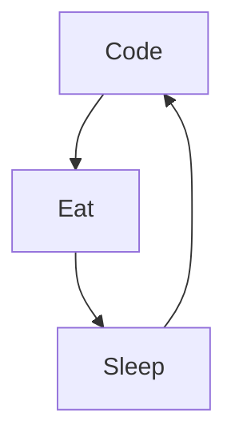

# Hello, Folks! 👋
Hello there this is Abokor Ahmed. Working as Web developer - at Djibouti Telecom. You can see my opensource work down below. I love to code in JavaScript and Python. I am a friendly guy you can connect with me on social media, I would love to have you in my life.

Actually:

- 🔭 I’m currently working on a new [Blog Project](https://github.com/Abokor-AN#)...
- 🌱 I’m currently learning amazing things ...
- 👯 Loving entrepreneurship as well as open-source ...
- ⚡ Fun fact : I'm Gold on League of Legend
- 📫 How to reach me: Email or Instagram

### Connect with me:

 
    
    
    
    
    

&nbsp;&nbsp;

### Languages and Tools:

 
 

### My daily routine :

### ⭐ GitHub Stats

📒 Latest blog content

<!-- BLOG-POST-LIST:START -->
- [Admin Système / Devops en Remote ?](https://www.mikecodeur.com/2023/12/24/admin-systeme-devops-en-remote/)
- [Chef de Projet / Scrum Master accessible en Remote ?](https://www.mikecodeur.com/2023/12/23/chef-de-projet-scrum-master-accessible-en-remote/)
- [La composantes métier](https://www.mikecodeur.com/2023/12/23/la-composantes-metier/)
- [Productif en Remote ?](https://www.mikecodeur.com/2023/12/22/productif-en-remote/)
- [Les meilleurs postes en REMOTE dans l’IT &lpar;Développeurs, Testeurs, CP,  PO, AMOA …&rpar;](https://www.mikecodeur.com/2023/12/21/les-meilleurs-postes-en-remote-dans-lit-developpeurs-testeurs-cp-po-amoa/)
<!-- BLOG-POST-LIST:END -->

[website]: https://app.abokor.com/blog
[mail]: mailto:abokor.ahmed.kadar.nour@gmail.com
[twitter]: https://x.com/AbokorNour
[linkedin]: https://www.linkedin.com/in/abokor-ahmed-kadar-nour
[instagram]: https://www.instagram.com/abokor98_ahmed_kadar